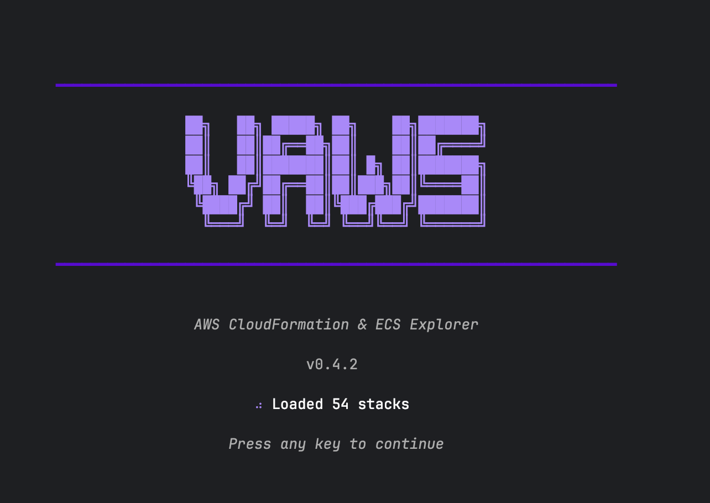

# vaws

A keyboard-driven terminal UI for exploring and managing AWS resources. Navigate CloudFormation stacks, ECS services, Lambda functions, and API Gateways with vim-style keybindings.




## Features

- **CloudFormation Stacks** - Browse stacks with status, outputs, and parameters
- **ECS Services** - View services, tasks, and deployments with health indicators
- **Lambda Functions** - List functions filtered by stack with runtime details
- **API Gateway** - Explore REST and HTTP APIs with stages and routes
- **Port Forwarding** - Tunnel to ECS containers and private API Gateways via SSM
- **Multi-account** - Switch between AWS profiles and regions on the fly

## Prerequisites

### Required Tools

| Tool | Purpose | Installation |
|------|---------|--------------|
| AWS CLI v2 | AWS authentication | [Install Guide](https://docs.aws.amazon.com/cli/latest/userguide/getting-started-install.html) |
| Session Manager Plugin | Port forwarding via SSM | `brew install --cask session-manager-plugin` |

### AWS Configuration

```bash
# Configure credentials (choose one)
aws configure                          # Access keys
aws configure sso                      # SSO (recommended)

# Login if using SSO
aws sso login --profile your-profile
```

### IAM Permissions

Your IAM role needs these permissions:

```
cloudformation:DescribeStacks, cloudformation:ListStackResources
ecs:ListClusters, ecs:ListServices, ecs:DescribeServices, ecs:ListTasks, ecs:DescribeTasks
lambda:ListFunctions, lambda:GetFunction
apigateway:GET
apigatewayv2:GetApis, apigatewayv2:GetStages, apigatewayv2:GetRoutes
ec2:DescribeInstances, ec2:DescribeVpcEndpoints
ssm:StartSession, ssm:DescribeInstanceInformation
```

## Installation

### Homebrew (macOS/Linux)

```bash
brew install erdemcemal/tap/vaws
```

### From Source

```bash
git clone https://github.com/erdemcemal/vaws.git
cd vaws
make install
```

### Binary Download

Download from [GitHub Releases](https://github.com/erdemcemal/vaws/releases).

## Usage

```bash
vaws                                    # Default profile and region
vaws --profile prod --region us-west-2  # Specific profile/region
vaws --debug                            # Enable debug logging
```

## Keyboard Shortcuts

### Navigation

| Key | Action |
|-----|--------|
| `j` / `↓` | Move down |
| `k` / `↑` | Move up |
| `Enter` | Select / Drill down |
| `Esc` | Go back |
| `g` | Jump to top |
| `G` | Jump to bottom |
| `/` | Filter current list |

### Views

| Key | Action |
|-----|--------|
| `1` | CloudFormation Stacks |
| `2` | ECS Services |
| `3` | Lambda Functions |
| `4` | API Gateway |
| `5` | Active Tunnels |
| `:` | Command palette |

### Actions

| Key | Action |
|-----|--------|
| `p` | Port forward |
| `r` | Refresh |
| `l` | Toggle logs |
| `t` | View tunnels |
| `x` | Stop tunnel |
| `c` | Clear terminated |
| `q` | Quit |

## Port Forwarding

### ECS Services (Fargate/EC2)

Forward traffic to containers running in ECS tasks.

**Requirements:**
- ECS task with `enableExecuteCommand: true`
- Task role with SSM permissions

**Steps:**
1. Navigate: **Stack → Services → Select service**
2. Press `p`, enter local port (or Enter for random)
3. Access at `http://localhost:<port>`

### Private API Gateway (Lambda Backend)

Access private API Gateways that invoke Lambda functions within a VPC. This is how you reach Lambda functions that aren't publicly accessible.

**Requirements:**
- Private API Gateway with VPC endpoint
- EC2 instance in the same VPC (jump host) with SSM agent
- Jump host's security group must allow outbound HTTPS (443)

**Architecture:**
```
localhost → SSM Tunnel → EC2 Jump Host → VPC Endpoint → API Gateway → Lambda
```

**Steps:**
1. Navigate: **API Gateway → Select private API → Stages → Select stage**
2. Press `p`, enter local port
3. Select a jump host from the list (SSM-managed EC2 instances)
4. Access at `http://localhost:<port>/your-endpoint`

**How it works:**
- Creates an SSM tunnel through the jump host to the API Gateway VPC endpoint
- Runs a local HTTP proxy that handles TLS termination
- Automatically prepends the stage name to your requests
- No need to modify `/etc/hosts` or use `curl --resolve`

**Example:**
```bash
# Your request
curl http://localhost:8080/users/123

# Gets forwarded as
https://<api-id>-<vpce-id>.execute-api.<region>.amazonaws.com/prod/users/123
```

## Configuration

### Optional Config File

Create `~/.vaws/config.yaml` for custom settings:

```yaml
profiles:
  production:
    jump_host: bastion-prod      # Preferred jump host name or instance ID
    region: us-east-1
  staging:
    jump_host: bastion-staging
    vpc_endpoint_id: vpce-xxx    # For cross-account API Gateway access

defaults:
  jump_host_tags:                # Auto-discovery by tags
    - "vaws:jump-host=true"
    - "Name=bastion"
  jump_host_names:               # Auto-discovery by name
    - "bastion"
    - "jumphost"
```

### Data Storage

| File | Purpose |
|------|---------|
| `~/.vaws/config.yaml` | User configuration |
| `~/.vaws/tunnels.json` | Persistent tunnel state |

## Troubleshooting

### ECS Port Forwarding: "TargetNotConnected"

```
TargetNotConnected: ecs:ecs-service-name_xxx is not connected
```

**Cause:** The ECS task doesn't have SSM connectivity.

**Solutions:**

1. **Enable Execute Command on the service:**
   ```bash
   aws ecs update-service --cluster <cluster> --service <service> --enable-execute-command
   ```

2. **Add SSM permissions to task role:**
   ```json
   {
     "Effect": "Allow",
     "Action": [
       "ssmmessages:CreateControlChannel",
       "ssmmessages:CreateDataChannel",
       "ssmmessages:OpenControlChannel",
       "ssmmessages:OpenDataChannel"
     ],
     "Resource": "*"
   }
   ```

3. **For private subnets, add VPC endpoints:**
   - `com.amazonaws.<region>.ssmmessages`
   - `com.amazonaws.<region>.ssm`

4. **Redeploy tasks** after enabling (existing tasks won't have SSM agent):
   ```bash
   aws ecs update-service --cluster <cluster> --service <service> --force-new-deployment
   ```

### Private API Gateway: "No VPC endpoint configured"

**Cause:** The API Gateway doesn't have a VPC endpoint ID in its configuration.

**Solutions:**

1. Check that the API Gateway is configured with `endpointConfiguration.vpcEndpointIds`
2. Or add `vpc_endpoint_id` to `~/.vaws/config.yaml` for cross-account access

### Jump Host: "No suitable jump host found"

**Cause:** No SSM-managed EC2 instances found.

**Solutions:**

1. Ensure EC2 instance has SSM agent running and is online
2. Check instance IAM role has `AmazonSSMManagedInstanceCore` policy
3. Configure a specific jump host in `~/.vaws/config.yaml`:
   ```yaml
   profiles:
     your-profile:
       jump_host: your-instance-name
   ```

## Development

```bash
make build      # Build binary
make test       # Run tests
make lint       # Run linter
make fmt        # Format code
```

## Contributing

Contributions are welcome! Please see [CONTRIBUTING.md](CONTRIBUTING.md) for guidelines.

## License

MIT License - see [LICENSE](LICENSE) for details.
